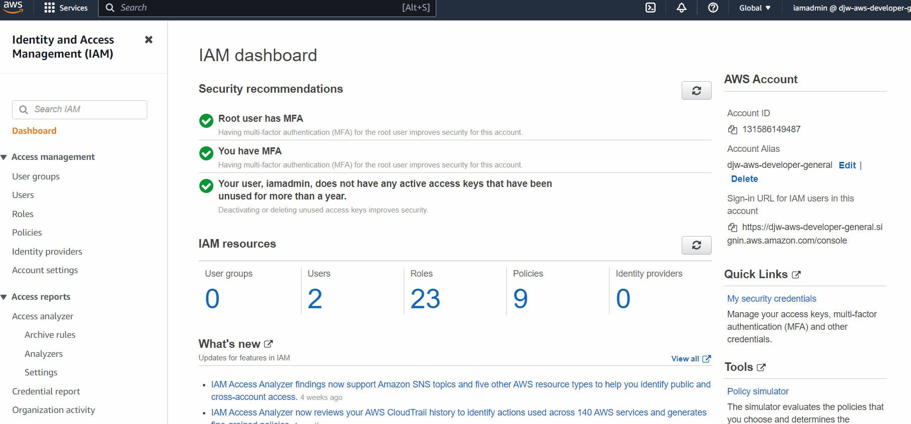
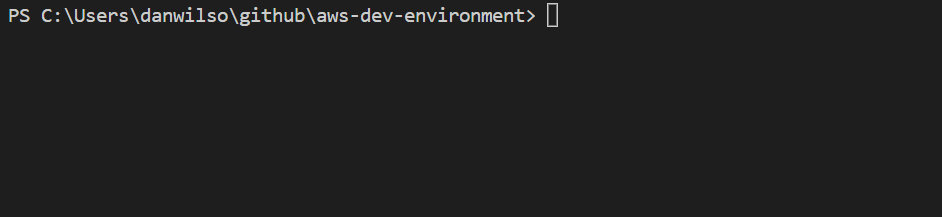
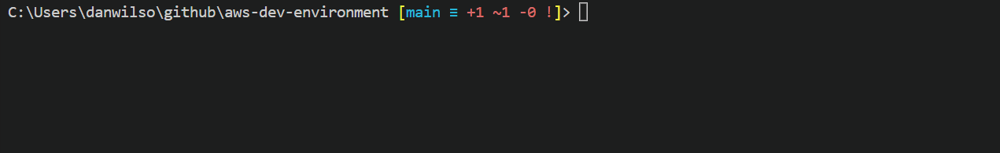
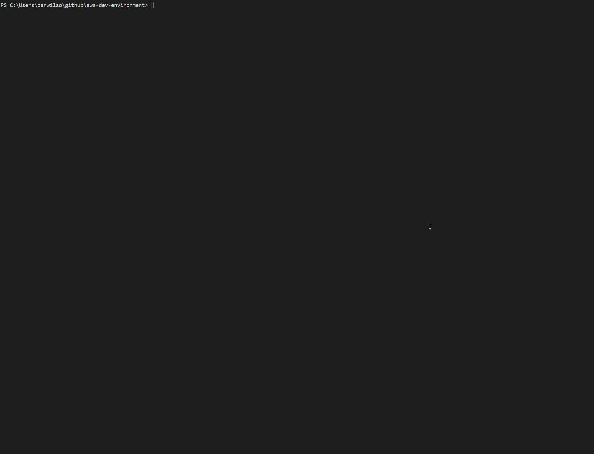
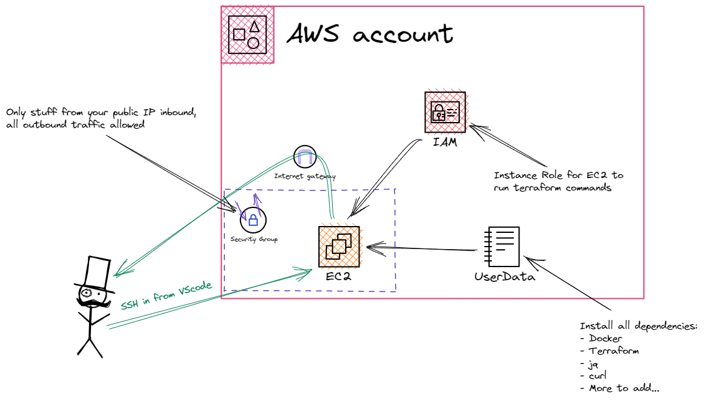

# AWS Dev Instance for VScode

## Overview
Are you fed up with trying to awkwardly develop on a windows machine, tried WSL2 and woke up one day to it being totally bawked by Windows 11? Fear not - Your free-tier AWS dev environment is here!  This is a slight extension of [Derek Morgan's course](https://courses.morethancertified.com/p/rfp-terraform) that teaches you how to build a dev instance in AWS using terraform.

:warning: **Advice!! Take Derek's course before proceeding** :warning: 

This repo is based on infrastructure deployed in [Derek Morgan's course](https://courses.morethancertified.com/p/rfp-terraform) "Build a Dev Environment with AWS and Terraform".  If you want to understand the underlying terraform code and what it's doing I really recommend taking the time to go through Derek's awesome content. 

---

## What you'll get..
After running through this readme you will have a way to spin up a development instance in AWS at will.  It will be accessible from your local machine over SSH using the native plugin for VScode.  Your Dev instance will:
- Be running Ubuntu
- Have python3 installled
- Have Docker installed
- Have Terraform installed
- Have an IAM role attached with Admin access to your AWS account

So What are you waiting for!? Clone this repo and let's do it.

## Prerequisites
- A Windows machine
- A working installation of [vscode](https://code.visualstudio.com/download)
- [Chocolatey](https://chocolatey.org/install) package manager for Windows - Not essential but helps!

## Contents
1. [Creating an AWS account](#creating-an-aws-account)
1. [Creating Terraform credentials in AWS](#creating-terraform-credentials-in-aws)
2. [Creating an SSH key](#creating-an-ssh-key)
3. [Installing terraform](#installing-terraform)
4. [Deploying your dev instance](#deploying-your-dev-instance)
5. [Connect to your instance](#connecting-to-your-instance)

## Creating an AWS account
Follow [this guide](https://youtu.be/FRQ9fE4fd5g) to create and secure a new AWS account.  

## Creating terraform credentials in AWS
- Log into your AWS account using the IAM user created in step 4 of the [creating an AWS account video guide](https://youtu.be/FRQ9fE4fd5g) linked in the previous step.


- Create a new user with programatic access only and save the Access and Secret keys somewhere safe!



- Run `.\scripts\aws_setup.ps1` to generate an AWS credentials file (assuming you don't have one already).  This will give Terraform what it needs to create resources in your account.



## Creating an SSH key
- In a PowerShell window enter the command `ssh-keygen -t ed25519` to create your keypair.

- Copy your public key to the root directory of this repo. `cp ~/.ssh/awsDevInstanceKey.pub .` you'll need it later!

## Installing Terraform
- If you already have Chocolatey installed then simply run `choco install terraform`
- If you're unable to install chocolatey then follow [these steps](https://spacelift.io/blog/how-to-install-terraform) to get terraform installed.

## Deploying your Dev instance
- Firstly generate your tfvars file by running `.\scripts\generate_tfvars.ps1`
    - This script will pull your public IP from whatsmyip.com and also set the local_development variable to _true_
- Run `terraform init` to initialise the directory
- Run `terraform apply`. Terraform will output a list of things that will happen, i.e stuff that will be created in your AWS account. Like this:



- Type `yes` and hit enter.
- Terraform will now go off and create the below infra in your account



## Connecting to your instance
- Once your terraform completes, you will see an output that looks like this:

```
ssh_config_info = <<EOT
Host 3.8.2.100
  HostName 3.8.2.100
  User ubuntu
  IdentityFile ~/.ssh/devInstanceKey

EOT
```
- This is the SSH information for your brand new EC2 dev instance
- Run `.\scripts\add_to_ssh_config.ps1` to add the SSH information to your config file and allow you to connect.
- Install the SSH extension to vscode
    - Click on Extensions `(ctrl+shift+x)` type `ssh` into the search box and install `Remote - SSH` by Microsoft.
- Press ctrl+shift+p to open the command pallet and type `ssh` click `Remote-SSH: Connect to host...`
- The FIRST IP address in the list will be your AWS instance, as the script will always place the latest IP address at the top of the config file. *Click on it!*
- Click on Linux
- Click on continue
- Your instance is now ready to use and has permissions to your AWS account via an instance role.,

##  But wait, what about Github access!?
I'm glad you asked...
